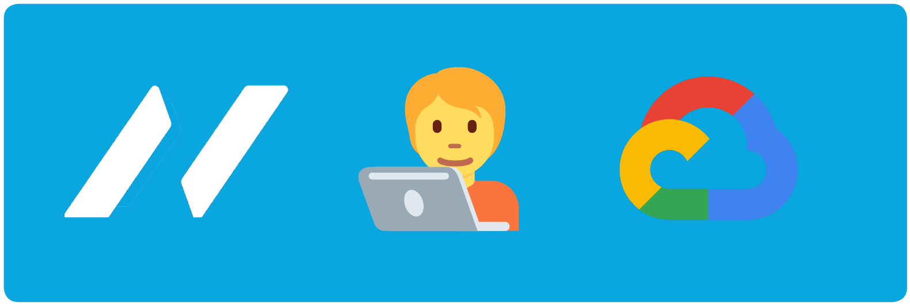

<h3 align="center">
  
   
  "Our passion is unlocking more  client value through technology."
   
</h3>

---

  <b>Currently building transformative solutions using the following technologies</b>
  

  
  
  
  
  
  
  
   
  
  
  

  
  
  

 

Through our commitment to:

1. **Quality,**
2. **Our focus on people,** and
3. **By challenging traditional thinking**

We believe that technology services can be done better.

> ##### Our people bring this to life by :sparkles: advising, :zap: transforming and :robot: managing technology to help our clients and communities

---

- [**Terraform Documentation**](https://www.terraform.io/docs/index.html)
- [**Google Cloud Platform Documentation**](https://cloud.google.com/docs)
- [**Cloud Foundation Fabric Repository**](https://github.com/GoogleCloudPlatform/cloud-foundation-fabric)
- [**Google Cloud Platform Blog**](https://cloud.google.com/blog)

---

Project maintained by **NCS DevOps Squad**. For any queries, please contact @EmileHofsink.

Project initially built by NCS Australia's Google Cloud Engineering Squad.

